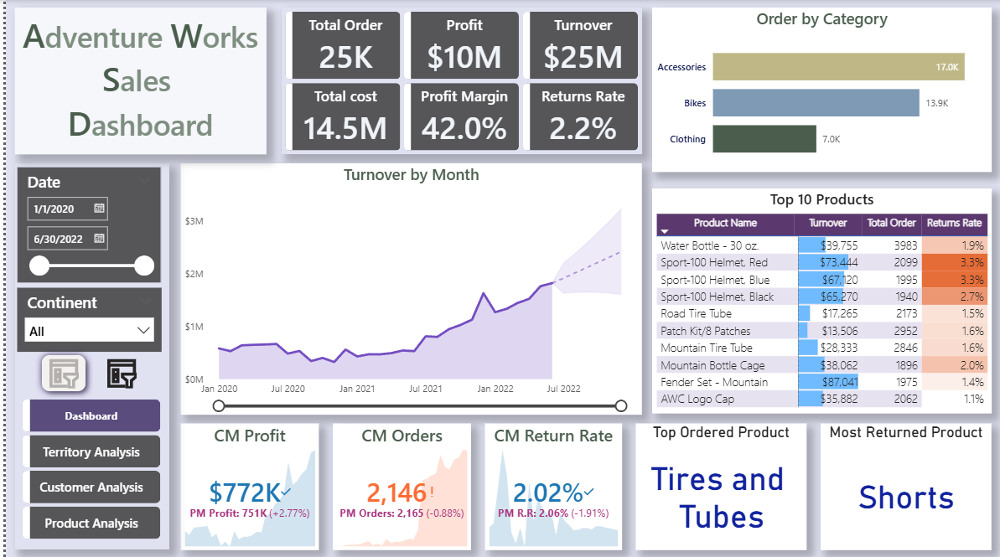
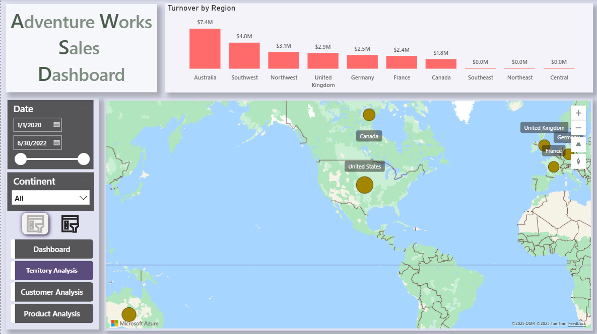
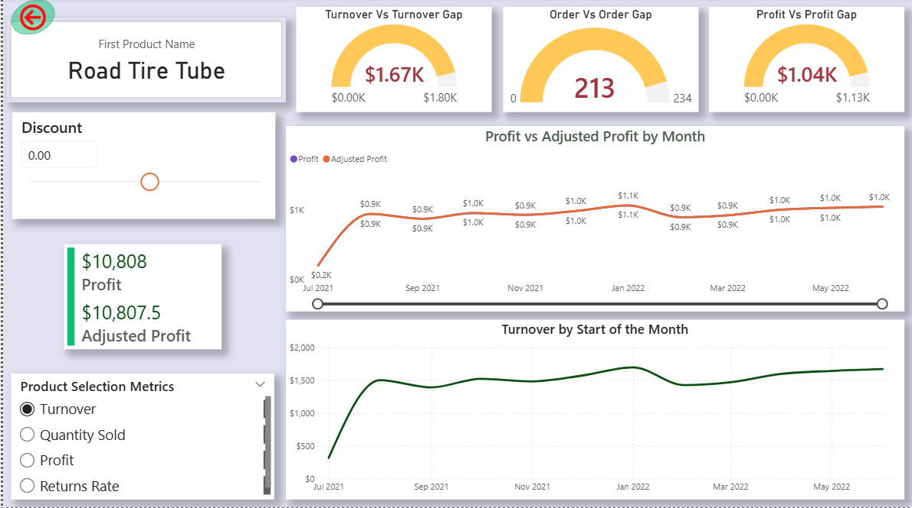
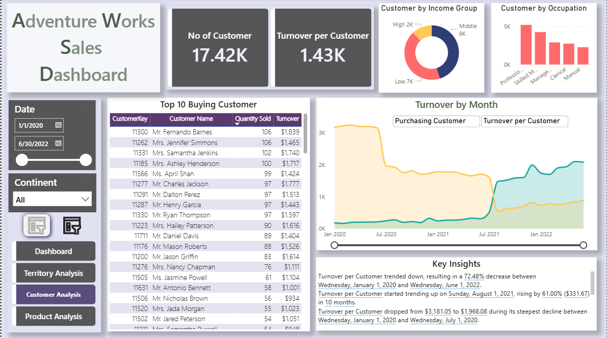

📌 Project Overview

The dashboard is based on the Adventure Works dataset and provides a 360° view of sales performance across regions, products, and customers. It helps business stakeholders make data-driven decisions by uncovering trends, identifying key revenue drivers, and highlighting customer behaviors.

📊 Dashboard Features

Sales Performance: Track orders, revenue, profit, cost, margins, and returns
  

Territory Analysis: Regional turnover insights with map visualizations
  

Product Analysis: Identify top-performing products, return rates, and category performance
 

Customer Analysis: Understand customer segmentation, buying patterns, and retention trends
 

Trend Analysis: Monitor monthly sales growth and forecast future performance

✅ Key Insights

Achieved $10M total profit with a 42% margin

Australia emerged as the highest turnover region with $7.4M revenue

Tires and Tubes ranked as the most ordered product

Average return rate observed: 2.2%

🛠️ Tools & Skills Used

Power BI (Data Modeling, DAX, Visualization)

Data Cleaning & Transformation in Power Query

Segmentation & Analytics (Customer and Product analysis)

Interactive Dashboard Design

🔗 Live Dashboard

Explore the interactive dashboard here: https://tinyurl.com/yfe63hwz
